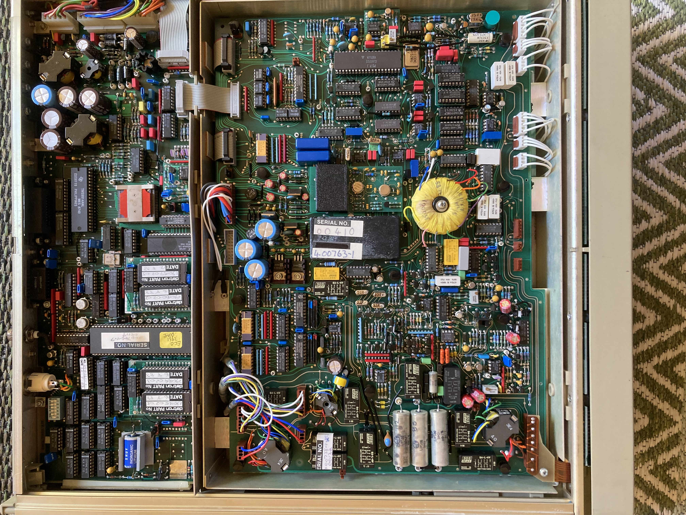

# DIY-Datron-1281-reference-board
Replacement board for potted reference modules in old Datron 1281

My Datron 1281 had two potted reference modules installed. One of the reference modules was jumping like crazy. So I had no other choice to rempve the potting. With a heatgun at 150°C the potting become soft and can be pealed away. For me a flathead screwdriver was the right toll for the job. In my case the LTZ1000 was defective. It is necessary to save the Vishay resistor network and the hermetic op amp from the old reference board. With some passives, a new LTZ1000 and this pcb it is possible to rebuild the reference module. I tried to design the pcb as close as possible to the original. All the guarding and removed soldering mask should be there. I also designed suitable caps for the reference IC. They can be 3D printed from PETG. In my case I could also save the isolation material for the LTZ1000 from the potted module. The isolation can be reinstalled in the 3D printed caps.

